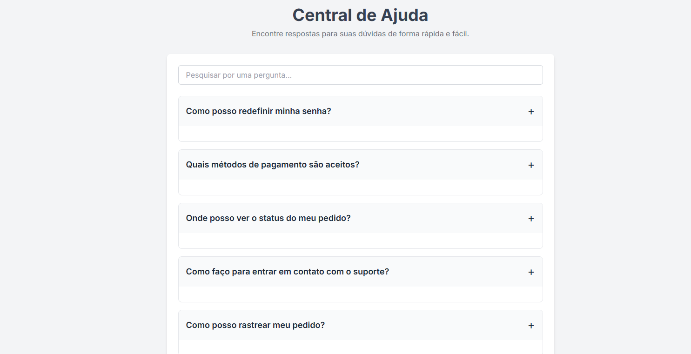

# 📚 Central de Ajuda

Uma interface web para uma base de conhecimento ou FAQ.  
O projeto foca em **usabilidade** e **design limpo**, permitindo que os usuários encontrem soluções de forma rápida e intuitiva.

---

## 🚀 Funcionalidades

- **Acordeão de Perguntas Frequentes**: Expanda e recolha as respostas com um clique.  
- **Barra de Pesquisa**: Encontre rapidamente perguntas específicas.  
- **Design Responsivo**: A interface se adapta a diferentes tamanhos de tela (desktop, tablet e celular).  

---

## 🛠️ Tecnologias Utilizadas

- **HTML** → Estrutura da página  
- **Tailwind CSS** → Estilização rápida e moderna  
- **JavaScript** → Lógica da pesquisa e do acordeão  

## 🖼️ Pré-visualização

